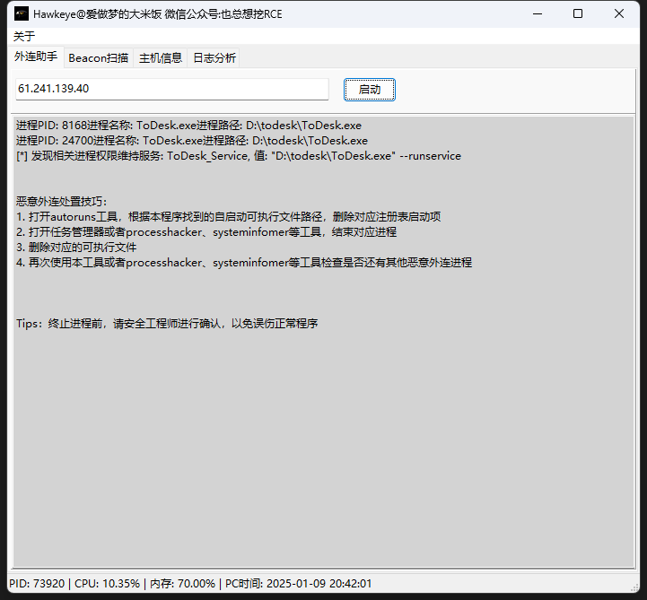
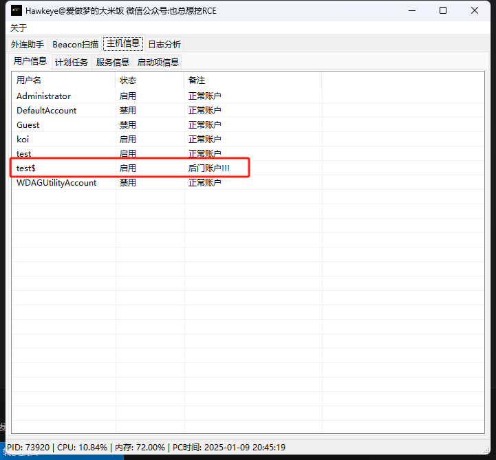
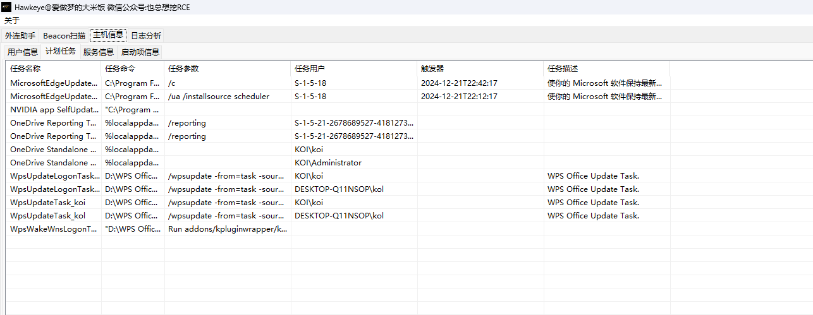
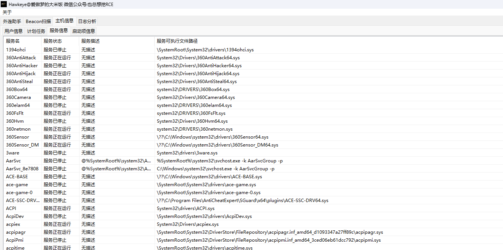
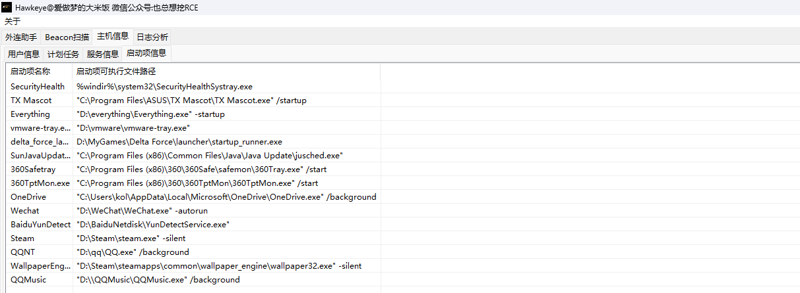
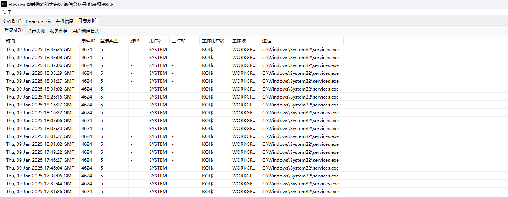
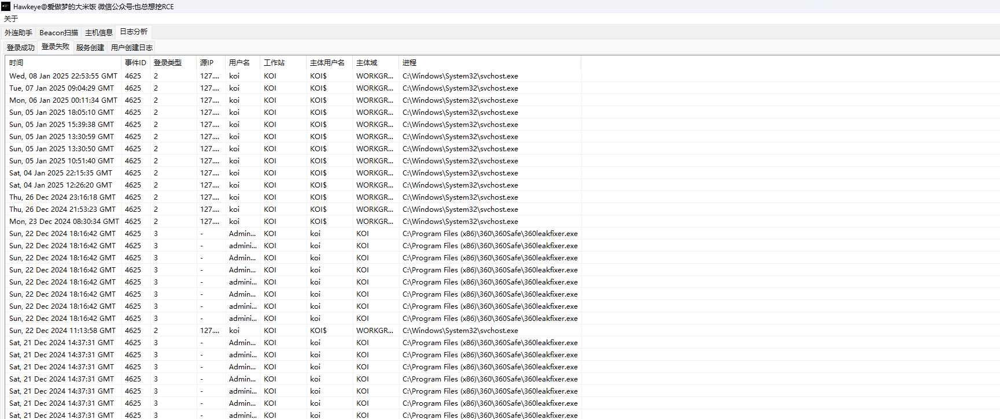
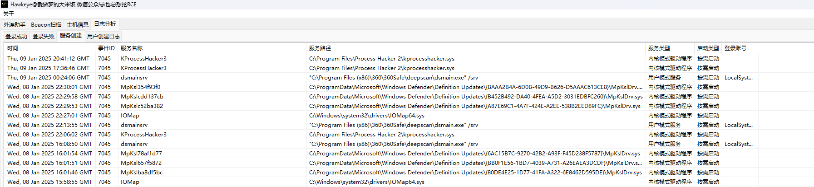
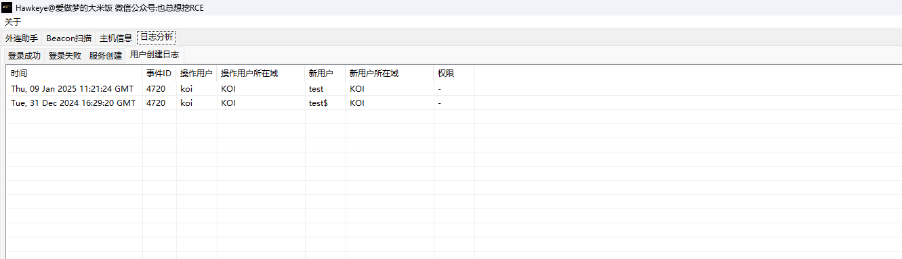

## Hawkeye 一款Windows综合应急响应工具
### 目的
Hawkeye(鹰眼)一款基于goalang开发的安全工具，旨在帮助安全工程师上机排查时能够快速的定位问题，提供排查思路。

### 功能
#### 外连分析
当发现主机存在恶意外连时，并且知道外连地址，能够快速的定位外连的进程，以及进程的连接信息。同时根据进程定位到对应的文件以及常见维持项。该功能适用于常见的外连场景，如挖矿，木马，后门等。
如下图所示，以todesk为例，通过外连分析功能，能够快速的定位到todesk.exe进程，以及进程的连接信息。

#### Beacon扫描
适用于主机存在C2外连场景，该功能能够快速的扫描主机上的beacon信息，包括beacon的进程信息，beacon的连接信息等。

#### 主机信息
该功能能够查看常见的主机信息，具体如下：

- 用户信息
能够查看当前主机用户，以及主机是否存在隐藏账号

- 计划任务
查看当前主机的计划任务以及触发时间

- 服务信息

- 启动项信息

#### 日志分析
- 登录成功日志
该功能会获取当前主机所有登录成功的日志，包括用户名，登录时间，登录IP等信息。

- 登录失败日志
该功能会获取当前主机所有登录失败的日志，包括用户名，登录时间，登录IP等信息。

- 服务创建日志
该功能会获取当前主机所有服务创建的日志，包括服务名，服务路径等信息。

- 用户创建日志
该功能会获取当前主机所有用户创建的日志，包括用户名，用户路径等信息。方便安全工程师查看是否存在可以账号的创建。

### Todo
1、yara进程、文件扫描
2、新增其他日志项，如计划任务、powershell、RDP等

### 微信公众号
更多安全问题，请关注微信公众号，获取更多信息。或者微信公众号后台联系作者，加入交流群，获取更多信息。

